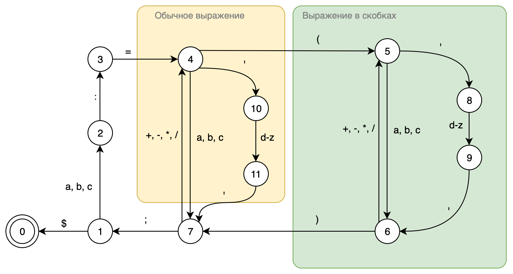

# Лексический и синтаксический анализатор

Необхоимо написать лексический и синтаксические анализаторы для заданного языка. Результат выполнения программы должен быть представелен в виде дерева разбора.

## Язык

Содержит:

- арифметические выражения, разделенные символом `;`
    - идентификатор (`a`, `b`, `c`)
    - символьная константа (`'d'` - `'z'`)
    - знак присваивания (`:=`)
    - операция (`+`, `-`, `+`, `/`)
    - круглые скобки (`(`, `)`)
- знак окончания строки (`$`)

Пример строк, принадлежащих языку:

- `b:=(c+b)+'e'+(a);b:='k';$`
- `c:=(b+c)/'f';b:=c;$`
- `a:=('f'+b);$`

## Ход решения

### Лексический анализ

Построим конечный автомат для лексического анализатора:



Затем определим лексемы языка:

- идентификатор (`a`, `b`, `c`)
- знак присваивания (`:=`)
- операция (`+`, `-`, `*`, `/`)
- открывающаяся скобка (`(`)
- закрывающаяся скобка (`)`)
- одинарная кавычка (`'`)
- символ (`d` - `z`)
- точка с запятой (`;`)
- конец строки (`$`)

На основе этого создадим лексический анализатор, который будет возвращать массив из лексем:

```swift
let tokenizer = Tokenizer<Token>(...)
switch tokenizer.tokenize() {
    case .success(let tokens):
        print("success: \(tokens)")
    case .failure(let error):
        print("error: \(error)")
}
```

### Синтаксический анализ

Определим правила (в угловых скобках - терминальные символы):

- S -> IMK
- S -> <$>
- E -> <;>S
- M -> <:=>
- K -> A
- K -> C
- G -> I
- G -> Q
- I -> <id>
- Q -> <'>D<'>
- D -> <symbol>
- A -> GL
- L -> OK
- L -> E
- O -> <operation>
- C -> <(>FL
- F -> GH
- H -> <)>
- H -> O

Будеи импользовать LL(1) - анализатор для построения дерева разбора.

Для данного способа необходимо определить таблицу синтаксического анализатора:

||`a`, `b` ,`c`|`+`, `-`, `/`, `*`|`:=`|`'`|`d`-`z`|`(`|`)`|`;`|`$`|
|------|-----|----|---|---|---------------|---|---|---|---|
|A     |12   |-1  |-1 |12 |-1             |-1 |-1 |-1 |-1 |
|C     |-1   |-1  |-1 |-1 |-1             |16 |-1 |-1 |-1 |
|D     |-1   |-1  |-1 |-1 |11             |-1 |-1 |-1 |-1 |
|E     |-1   |-1  |-1 |-1 |-1             |-1 |-1 |3  |-1 |
|F     |17   |-1  |-1 |17 |-1             |-1 |-1 |-1 |-1 |
|G     |7    |-1  |-1 |8  |-1             |-1 |-1 |-1 |-1 |
|H     |-1   |19  |-1 |-1 |-1             |-1 |18 |-1 |-1 |
|I     |9    |-1  |-1 |-1 |-1             |-1 |-1 |-1 |-1 |
|K     |5    |-1  |-1 |5  |-1             |6  |-1 |-1 |-1 |
|L     |-1   |13  |-1 |-1 |-1             |-1 |-1 |14 |-1 |
|M     |-1   |-1  |4  |-1 |-1             |-1 |-1 |-1 |-1 |
|O     |-1   |15  |-1 |-1 |-1             |-1 |-1 |-1 |-1 |
|Q     |-1   |-1  |-1 |10 |-1             |-1 |-1 |-1 |-1 |
|S     |1    |-1  |-1 |-1 |-1             |-1 |-1 |-1 |-2 |

Создадим синтаксический анализатор, который будет работать на основе рекурсивного спуска:

```swift
let parser = Parser(...)
switch parser.parse() {
case .success(let tree):
    print("success")
case .failure(let error):
    print("error: \(error)")
}
```


## Пример

Дана строчка: `a:=('f'+b);c:='k';$`

Лексический анализатор разбивает эту строчку на лексемы: `<id: a><:=><(><'><symbol: f><'><operation: +><id: b><)><;><id: c><:=><'><symbol: k><'><;><$>`

Синтаксический анализатор строит дерево разбора:

```
S
├── I
│   └── <id: a>
├── M
│   └── <:=>
└── K
    └── C
        ├── <(>
        ├── F
        │   ├── G
        │   │   └── Q
        │   │       ├── <'>
        │   │       ├── D
        │   │       │   └── <symbol: f>
        │   │       └── <'>
        │   └── H
        │       ├── O
        │       │   └── <operation: +>
        │       └── F
        │           ├── G
        │           │   └── I
        │           │       └── <id: b>
        │           └── H
        │               └── <)>
        └── L
            └── E
                ├── <;>
                └── S
                    ├── I
                    │   └── <id: c>
                    ├── M
                    │   └── <:=>
                    └── K
                        └── A
                            ├── G
                            │   └── Q
                            │       ├── <'>
                            │       ├── D
                            │       │   └── <symbol: k>
                            │       └── <'>
                            └── L
                                └── E
                                    ├── <;>
                                    └── S
                                        └── <$>
```